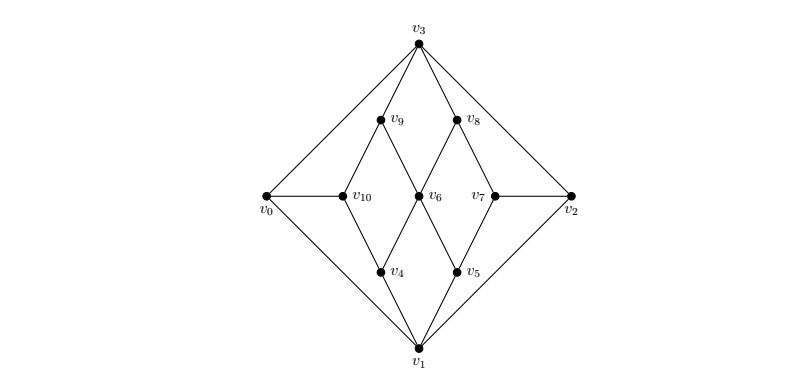
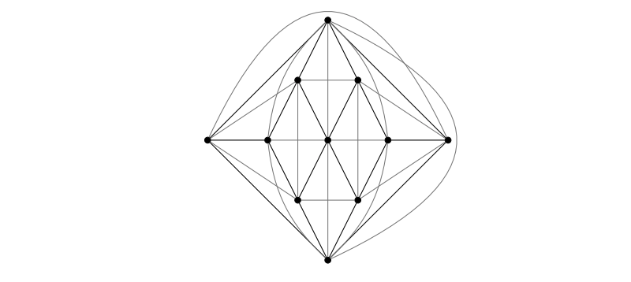

# optimal-1-planar-gen

This repository contains an algorithm for generating optimal 1-planar graphs. The implementation is based on SageMath 8.8. and the program [plantri](https://users.cecs.anu.edu.au/~bdm/plantri/) written by Gunnar Brinkmann and Brendan McKay. Plantri uses [nauty](http://pallini.di.uniroma1.it/) for rejecting isomorphic graphs.
 
 
A graph is 1-planar if it can be embedded in the plane such that each edge cross at most once. If a 1-planar graph with n vertices has 4n−8 edges, it is called optimal
1-planar. The family of optimal 1-planar graphs can be obtained by generating simple plane quadrangulations and then adding the crossing diagonals in each face.
 
 
A quadrangulation of the sphere is a finite graph embedded on the sphere, such that every face is bounded by a walk of 4 edges. A simple quadrangulation is a quadrangulation with no multiple edges. In other words: the boundary of each face of a simple quadrangulation corresponds to a 4-cycle of the graph. We sometimes shall simply write quadrangulation instead of simple quadrangulation if no confusion arises.
 
 
Now, let Q be a simple quadrangulation of order n > 2 with n-2 faces and 2(n-2) edges. Adding the crossing diagonal edges in each of the n-2 faces, the resulting graph is called optimal 1-planar or maximal 1-planar, if no parallel edges occur. The one-to-one correspondence between the family of optimal 1-planar graphs and the family of quadrangulations was first discovered by Ringel, implied by Bodendiek et al., but formally proven by Fabrici and Madaras.
 
It is helpful to differentiate between the simple quadrangulation and its optimal 1-planar extension. Formally, we speak of a planar skeleton:
Given a 1-planar embedding G. Removing the crossing edges from G results in a simple quadrangulation Q. We call Q the planar skeleton, or simple skeleton, of G.
 
 
Consider a simple quadrangulation Q on n=11 vertices. A possible planar embedding is given by the following figure
 
 

 
 
Adding the crossing diagonals in edge of the faces of Q results in an optimal 1-planar graph. Its embedding is given by the following figure
 
 

 
 
The generation of the planar skeletons, namely the simple quadrangulations, is implemented in plantri. We call plantri within sage, generate the planar skeletons and then simply add the crossing diagonals in each face. It would have been more efficient to extend the original C-code of plantri, but also more time consuming ;).

## References

[1] V. Berhard. Zur Morphologie der Polyeder. Teubner, 1891. 
[2] R. Bodendiek, H. Schumacher, and K. Wagner. "Über 1-optimale Graphen". In: Mathematische Nachrichten 117.1 (1984), pp. 323-339. 
[3] Gunnar Brinkmann et al. "Generation of simple quadrangulations of the sphere". In: MATCH Commun. Math. Comput. Chem 58.2 (2007), pp. 323-357. 
[4] Gunnar Brinkmann et. al. "Generation of simple quadrangulations of the sphere". In: Discrete Mathematics 305.1-3 (2005), pp. 33-54. 
[5] Igor Fabrici and Tomáš Madaras. "The structure of 1-planar graphs". In: Discrete Mathematics 307.7-8 (2007), pp. 854-865. 
[6] Brendan D. McKay and Adolfo Piperno. "Practical graph isomorphism, II". In: Journal of Symbolic Computation 60 (2014), pp. 94-112. 

## License
### MIT License
